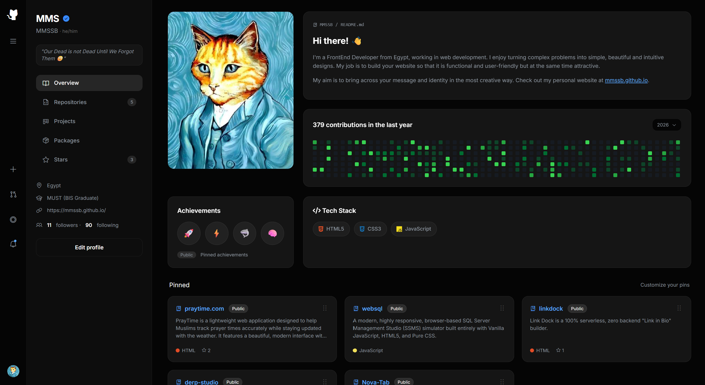
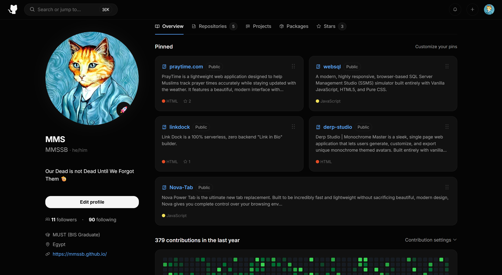

  
  <h1>🚀 GitHub Pages Redesigns</h1>

  
  
  

 

  <h3>🌟 <a href="https://mmssb.github.io/github-designs">View the Main Live Demo Collection</a> 🌟</h3>

 

## 📖 Overview
**GitHub Designs** is a collection of modern, fully responsive UI reimaginings of the classic GitHub profile page. The goal of this project is to explore how developer portfolios could look using 2026 design trends, focusing on clean aesthetics, fluid responsiveness, and premium user experiences.

## ✨ Key Features

* **🍱 Smart Bento Grid:** A dynamic, masonry-style grid layout that automatically reflows based on screen size (stretching, squashing, and reordering cards seamlessly).
* **📱 True Mobile-First Experience:** 
  * Sticky glassmorphism top navigation bar.
  * Smooth slide-out mobile drawer (side menu) with a dark overlay.
  * Swipeable pill-shaped navigation tabs.
* **📊 Dynamic Contribution Graph:** A vanilla JavaScript-powered mock contribution graph that generates realistic commit activity data on load.
* **🎨 Modern UI/UX Trends:** Features subtle hover glows, floating action buttons, drag-and-drop grip icons, and sleek transitions.
* **⚡ Zero Dependencies:** Built entirely with raw HTML5, CSS3, and Vanilla JavaScript (utilizing Phosphor and FontAwesome for crisp iconography).

## 📂 Project Structure & Designs

This repository contains different iterations and experiments of the profile redesign:

### 1. Smart Bento Profile (`github1.html`)
A comprehensive, data-rich Bento UI layout featuring pinned repositories, customized tech stack tags, and a highly intelligent responsive grid that adapts perfectly to desktop, tablet, and mobile screens.
* 🖥️ **Live Demo:** [View Smart Bento Profile](https://mmssb.github.io/github-designs/designs/github1)
* 📸 **Preview:**
 

 

### 2. Classic Modern Profile (`github.html`)
A sleek, app-like interpretation of the GitHub profile featuring a centered layout, fixed bottom mobile navigation, and floating search bars.
* 🖥️ **Live Demo:** [View Classic Modern Profile](https://mmssb.github.io/github-designs/designs/github)
* 📸 **Preview:**
 

